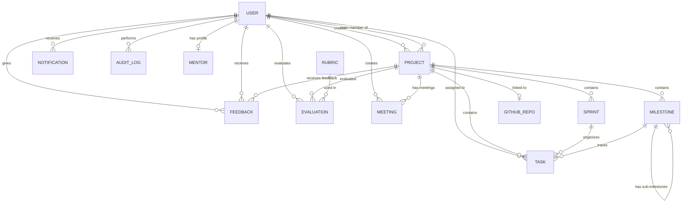

# Database Schema Documentation

## Student Project Tracker — MongoDB

This document covers all the database models used in the Student Project Tracker application. We use MongoDB with Mongoose as the ODM. There are 14 models in total.

The database is hosted on MongoDB Atlas, and the Mongoose version is 9.

---

## How the data connects

Here's a visual overview of how the models relate to each other:

---

## 1. User

Collection: `users` — File: `server/models/User.js`

This is the central model. Every person in the system — students, mentors, and admins — is a User. Mentor-specific fields like `expertise`, `company`, and `availability` are stored directly on the User model for convenience, though there's also a separate Mentor model for the profile/resume.

The email gets normalized to lowercase and trimmed before saving.

| Field | Type | Required | Default | Description |
|:------|:-----|:---------|:--------|:------------|
| name | String | Yes | — | Full name |
| email | String | Yes | — | Unique, lowercase, trimmed |
| password | String | Yes | — | Bcrypt hashed |
| role | String | Yes | — | Student, Mentor, or Admin |
| collegeId | String | No | — | College enrollment ID |
| bio | String | No | — | Short biography |
| skills | [String] | No | — | Skill tags |
| experience | String | No | — | Work experience |
| education | String | No | — | Education details |
| expertise | [String] | No | — | Mentor expertise areas |
| availability | Boolean | No | true | Mentor availability |
| company | String | No | — | Mentor's company |
| linkedin | String | No | — | LinkedIn profile URL |
| github | String | No | — | GitHub profile URL |
| photo | String | No | — | Cloudinary photo URL |
| createdAt | Date | Auto | — | Timestamp |
| updatedAt | Date | Auto | — | Timestamp |

---

## 2. Project

Collection: `projects` — File: `server/models/Project.js`

Projects are the core unit of work. A project has a creator (usually a student), team members, an optional mentor, and can be linked to a GitHub repo. The title is automatically uppercased on save.

There's a `teamMembersGithub` array that stores GitHub usernames for team members, used when setting up the repo integration.

| Field | Type | Required | Default | Description |
|:------|:-----|:---------|:--------|:------------|
| title | String | Yes | — | Auto-uppercased on save |
| description | String | No | — | Project description |
| creator | ObjectId (User) | No | — | Who created it |
| students | [ObjectId (User)] | No | [] | Student members |
| teamMembers | [ObjectId (User)] | No | — | Team member refs |
| mentor | ObjectId (User) | No | — | Assigned mentor |
| startDate | Date | No | — | Start date |
| endDate | Date | No | — | End date |
| status | String | No | Planning | Planning/Active/App Complete/Completed |
| progress | Number | No | 0 | 0-100 completion percentage |
| githubRepo | String | No | — | owner/repo format |
| githubRepoUrl | String | No | — | Full GitHub URL |
| githubRepoCreatedBy | ObjectId (User) | No | — | Who linked the repo |
| shouldCreateGithubRepo | Boolean | No | false | GitHub setup flag |
| teamMembersGithub | [Object] | No | — | userId, name, email, githubUsername, joinedGithub |
| mentorResume | String | No | — | Mentor resume path |
| isStuck | Boolean | No | false | Project stuck flag |
| teamSize | Number | No | 3 | Max team size (1-10) |
| createdAt | Date | Auto | — | Timestamp |
| updatedAt | Date | Auto | — | Timestamp |

Hooks: `pre('save')` and `pre('findOneAndUpdate')` both uppercase the title.

---

## 3. Task

Collection: `tasks` — File: `server/models/Task.js`

Tasks belong to a project and can optionally be linked to a milestone and a sprint. Students submit their work (with screenshots uploaded to Cloudinary), and mentors review those submissions.

The `submissionStatus` tracks the review cycle: none → pending_review → approved/rejected.

| Field | Type | Required | Default | Description |
|:------|:-----|:---------|:--------|:------------|
| title | String | Yes | — | Task title |
| description | String | No | — | Description |
| project | ObjectId (Project) | Yes | — | Parent project |
| milestone | ObjectId (Milestone) | No | — | Linked milestone |
| assignedTo | ObjectId (User) | No | — | Assigned student |
| sprint | ObjectId (Sprint) | No | — | Sprint assignment |
| storyPoints | Number | No | 0 | For burndown tracking |
| status | String | No | Pending | Pending/In Progress/Completed |
| deadline | Date | No | — | Task deadline |
| priority | String | No | Medium | Low/Medium/High |
| completedAt | Date | No | — | When it was finished |
| submission.githubLink | String | No | — | GitHub commit/PR link |
| submission.screenshots | [String] | No | — | Cloudinary URLs (max 5) |
| submission.submittedAt | Date | No | — | When submitted |
| submission.submittedBy | ObjectId (User) | No | — | Who submitted |
| submissionStatus | String | No | none | none/pending_review/approved/rejected |
| submissionLink | String | No | — | Legacy field |
| isVerified | Boolean | No | false | Mentor verified |
| verifiedAt | Date | No | — | Verification timestamp |
| githubIssueId | Number | No | — | GitHub issue number |
| githubUrl | String | No | — | GitHub issue URL |
| createdAt | Date | Auto | — | Timestamp |
| updatedAt | Date | Auto | — | Timestamp |

---

## 4. Sprint

Collection: `sprints` — File: `server/models/Sprint.js`

Sprints are time-boxed iterations within a project. Tasks get assigned to sprints, and the burndown chart API uses story points to calculate progress.

| Field | Type | Required | Default | Description |
|:------|:-----|:---------|:--------|:------------|
| name | String | Yes | — | Sprint name |
| project | ObjectId (Project) | Yes | — | Parent project |
| startDate | Date | Yes | — | Start date |
| endDate | Date | Yes | — | End date |
| goal | String | No | — | Sprint goal |
| status | String | No | Planned | Planned/Active/Completed |
| createdAt | Date | Auto | — | Timestamp |
| updatedAt | Date | Auto | — | Timestamp |

---

## 5. Milestone

Collection: `milestones` — File: `server/models/Milestone.js`

Milestones represent major checkpoints in a project. They can have child milestones (sub-milestones) and linked tasks. Students submit work against milestones, and mentors approve or reject them. The completion percentage updates automatically based on how many linked tasks are done.

| Field | Type | Required | Default | Description |
|:------|:-----|:---------|:--------|:------------|
| title | String | Yes | — | Milestone title |
| description | String | No | — | Description |
| project | ObjectId (Project) | Yes | — | Parent project |
| parentMilestone | ObjectId (Milestone) | No | — | Parent (for sub-milestones) |
| submilestones | [ObjectId (Milestone)] | No | — | Child milestones |
| tasks | [ObjectId (Task)] | No | — | Linked tasks |
| dueDate | Date | No | — | Due date |
| status | String | No | Not Started | Not Started/In Progress/Submitted/Completed/Approved |
| priority | String | No | Medium | Low/Medium/High |
| isSubMilestone | Boolean | No | false | Whether it's a child |
| submittedBy | ObjectId (User) | No | — | Student who submitted |
| submittedAt | Date | No | — | Submission timestamp |
| submissionDescription | String | No | — | What was done |
| submissionGithubLink | String | No | — | GitHub link |
| submissionStatus | String | No | null | pending/approved/rejected |
| approvedBy | ObjectId (User) | No | — | Mentor who reviewed |
| approvedAt | Date | No | — | Review timestamp |
| approvalNotes | String | No | — | Mentor's notes |
| completionPercentage | Number | No | 0 | 0-100 based on tasks |
| order | Number | No | 0 | Display ordering |
| createdAt | Date | Auto | — | Timestamp |
| updatedAt | Date | Auto | — | Timestamp |

---

## 6. Meeting

Collection: `meetings` — File: `server/models/Meeting.js`

Meetings are scheduled by mentors and linked to a project. Team members are tracked with their join status. The system auto-archives meetings that are past their scheduled date.

| Field | Type | Required | Default | Description |
|:------|:-----|:---------|:--------|:------------|
| title | String | Yes | — | Meeting title |
| description | String | No | — | Description |
| zoomMeetingLink | String | Yes | — | Zoom URL |
| zoomMeetingId | String | No | — | Zoom meeting ID |
| createdBy | ObjectId (User) | Yes | — | Who created it |
| createdByRole | String | Yes | — | Student/Mentor/Admin |
| project | ObjectId (Project) | Yes | — | Linked project |
| mentor | ObjectId (User) | No | — | Assigned mentor |
| teamMembers | [Object] | No | — | userId, name, email, joinedAt, status |
| scheduledDate | Date | Yes | — | When it's scheduled |
| duration | Number | No | — | Duration in minutes |
| status | String | No | scheduled | scheduled/ongoing/completed/cancelled |
| notes | String | No | — | Meeting notes |
| recordingLink | String | No | — | Recording URL |
| createdAt | Date | Auto | — | Timestamp |
| updatedAt | Date | Auto | — | Timestamp |

The `teamMembers` status field tracks whether someone was "invited", "joined", or "attended".

---

## 7. Feedback

Collection: `feedbacks` — File: `server/models/Feedback.js`

Simple model for mentor-to-student feedback on project work. Each entry links a sender and recipient to a specific project.

| Field | Type | Required | Default | Description |
|:------|:-----|:---------|:--------|:------------|
| project | ObjectId (Project) | Yes | — | Which project |
| from | ObjectId (User) | Yes | — | Sender (mentor) |
| to | ObjectId (User) | Yes | — | Recipient (student) |
| message | String | Yes | — | Feedback text |
| rating | Number | No | — | 1-5 star rating |
| createdAt | Date | Auto | — | Timestamp |
| updatedAt | Date | Auto | — | Timestamp |

---

## 8. Evaluation

Collection: `evaluations` — File: `server/models/Evaluation.js`

Evaluations are rubric-based assessments of projects. A mentor selects a rubric, scores each criterion, and the system calculates a weighted total.

| Field | Type | Required | Default | Description |
|:------|:-----|:---------|:--------|:------------|
| project | ObjectId (Project) | Yes | — | Evaluated project |
| evaluator | ObjectId (User) | Yes | — | Mentor/judge |
| rubric | ObjectId (Rubric) | Yes | — | Which rubric |
| scores | Map (String→Number) | No | — | Criterion name to score |
| comments | String | No | — | Comments |
| totalScore | Number | No | — | Weighted total |
| feedback | String | No | — | Additional feedback |
| createdAt | Date | Auto | — | Timestamp |
| updatedAt | Date | Auto | — | Timestamp |

---

## 9. Rubric

Collection: `rubrics` — File: `server/models/Rubric.js`

Rubrics define the grading criteria for evaluations. They can be global (available for all projects) or specific to one project.

| Field | Type | Required | Default | Description |
|:------|:-----|:---------|:--------|:------------|
| name | String | Yes | — | Rubric name |
| project | ObjectId (Project) | No | — | Specific project |
| isGlobal | Boolean | No | false | Available globally |
| criteria | [Object] | No | — | Array of criteria |
| criteria[].name | String | Yes | — | Criterion name |
| criteria[].description | String | No | — | What it measures |
| criteria[].weight | Number | No | 1 | Score multiplier |
| criteria[].maxScore | Number | No | 10 | Maximum possible score |
| createdBy | ObjectId (User) | No | — | Who made it |
| createdAt | Date | Auto | — | Timestamp |
| updatedAt | Date | Auto | — | Timestamp |

---

## 10. Notification

Collection: `notifications` — File: `server/models/Notification.js`

In-app notifications for events like new meetings, feedback, and task assignments. They auto-expire after 30 days.

| Field | Type | Required | Default | Description |
|:------|:-----|:---------|:--------|:------------|
| recipient | ObjectId (User) | Yes | — | Who receives it |
| type | String | Yes | — | Event type (see below) |
| title | String | Yes | — | Notification title |
| message | String | Yes | — | Notification body |
| relatedMeeting | ObjectId (Meeting) | No | — | Related meeting |
| relatedProject | ObjectId (Project) | No | — | Related project |
| createdBy | ObjectId (User) | No | — | Who triggered it |
| isRead | Boolean | No | false | Read status |
| readAt | Date | No | — | When read |
| expiresAt | Date | No | now + 30 days | Auto-delete date |
| createdAt | Date | Auto | — | Timestamp |

Type values: `meeting_created`, `meeting_joined`, `meeting_started`, `feedback_received`, `task_assigned`, `milestone_reviewed`

---

## 11. AuditLog

Collection: `auditlogs` — File: `server/models/AuditLog.js`

Tracks important system events for security and accountability. Each entry records who performed the action, what they did, and where the request came from.

| Field | Type | Required | Default | Description |
|:------|:-----|:---------|:--------|:------------|
| user | ObjectId (User) | No | — | Who did it (null for system actions) |
| action | String | Yes | — | What happened |
| resource | String | No | — | What was affected |
| details | Object | No | — | Extra context |
| ipAddress | String | No | — | Request IP |
| userAgent | String | No | — | Browser info |
| createdAt | Date | Auto | — | Timestamp |

Logged actions include: LOGIN, FAILED_LOGIN, CREATE_PROJECT, DELETE_PROJECT, CREATE_SPRINT, UPDATE_SPRINT_STATUS, CREATE_RUBRIC, SUBMIT_EVALUATION, ROLE_CHANGE, PERMISSION_DENIED, BACKUP_DELETED.

---

## 12. Settings

Collection: `settings` — File: `server/models/Settings.js`

This is a **singleton** — only one document exists in the collection. It stores all system-wide configuration. The model has a pre-save hook that prevents creating a second document.

| Field | Type | Default | Description |
|:------|:-----|:--------|:------------|
| maintenanceMode | Boolean | false | Blocks non-admin logins |
| allowRegistration | Boolean | true | Open/close sign-ups |
| emailNotifications | Boolean | true | Email on/off |
| backupFrequency | String | daily | hourly/daily/weekly/monthly |
| logRetention | Number | 30 | Days to keep logs |
| sessionTimeout | Number | 60 | Token validity in minutes |
| maxFileUploadSize | Number | 10 | Upload limit in MB |
| rateLimiting | Number | 100 | Requests per window |
| cacheExpiration | Number | 24 | Cache lifetime in hours |
| services.apiServer | Boolean | true | API server toggle |
| services.database | Boolean | true | Database monitoring |
| services.emailService | Boolean | true | Email service |
| services.githubIntegration | Boolean | true | GitHub API |
| services.fileStorage | Boolean | true | Cloudinary uploads |
| services.notificationService | Boolean | true | In-app notifications |
| services.cacheService | Boolean | true | Response caching |
| services.backupService | Boolean | true | Database backups |
| lastBackupTime | Date | null | Last backup ran |
| lastHealthCheck | Date | null | Last health check |
| systemHealth.status | String | healthy | healthy/warning/critical |
| systemHealth.cpuUsage | Number | 0 | CPU usage percentage |
| systemHealth.memoryUsage | Number | 0 | Memory usage percentage |
| systemHealth.diskUsage | Number | 0 | Disk usage percentage |

---

## 13. GitHubRepo

Collection: `githubrepos` — File: `server/models/GitHubRepo.js`

Stores cached GitHub repository data so we don't have to call the GitHub API every time. Data gets refreshed when someone hits the sync endpoint. Each project can have one linked repo.

| Field | Type | Required | Default | Description |
|:------|:-----|:---------|:--------|:------------|
| projectId | ObjectId (Project) | Yes | — | Linked project |
| repoUrl | String | Yes | — | Full GitHub URL |
| repoName | String | Yes | — | Repository name |
| owner | String | Yes | — | GitHub owner/org |
| description | String | No | — | Repo description |
| stars | Number | No | 0 | Star count |
| commits | [Object] | No | — | sha, message, author, date, url |
| contributors | [Object] | No | — | login, avatar_url, contributions, profile_url |
| branches | [Object] | No | — | name, protected |
| pullRequests | [Object] | No | — | number, title, state, author, created_at, url |
| lastSynced | Date | No | now | Last time data was fetched |
| linkedAt | Date | No | now | When repo was first linked |

---

## 14. Mentor

Collection: `mentors` — File: `server/models/Mentor.js`

Extends the User model with mentor-specific data. Created automatically when a user registers with the "Mentor" role. Stores the resume uploaded to Cloudinary.

| Field | Type | Required | Default | Description |
|:------|:-----|:---------|:--------|:------------|
| user | ObjectId (User) | Yes | — | Linked user account |
| expertise | [String] | No | — | Areas of expertise |
| bio | String | No | — | Mentor biography |
| availability | Boolean | No | true | Open for mentoring |
| resume | String | No | — | Cloudinary resume URL |
| createdAt | Date | Auto | — | Timestamp |
| updatedAt | Date | Auto | — | Timestamp |
